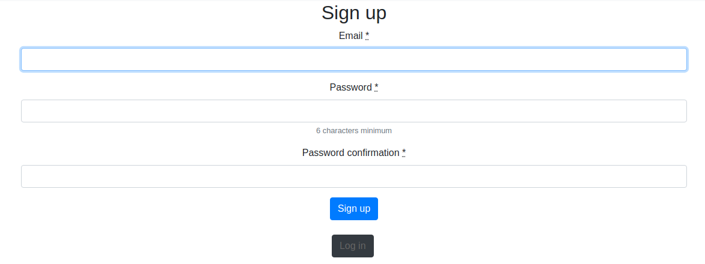
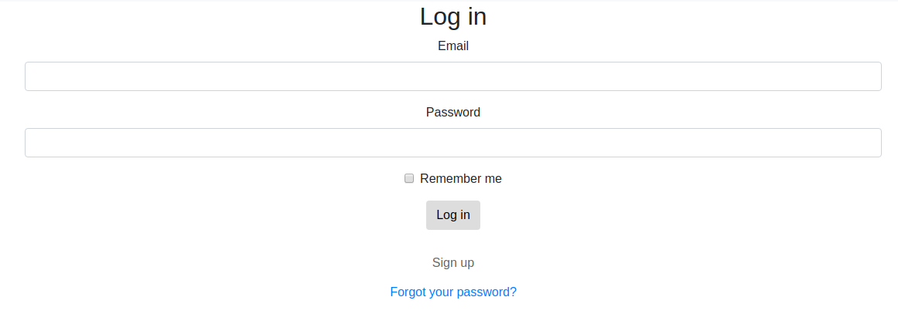
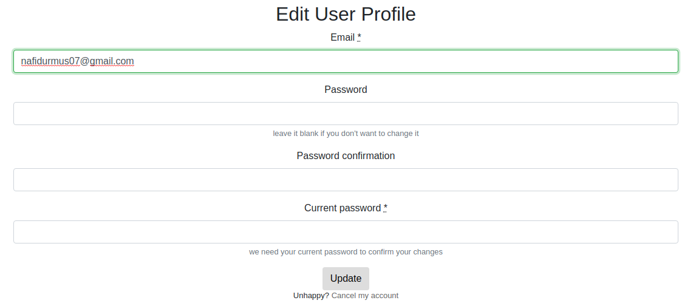
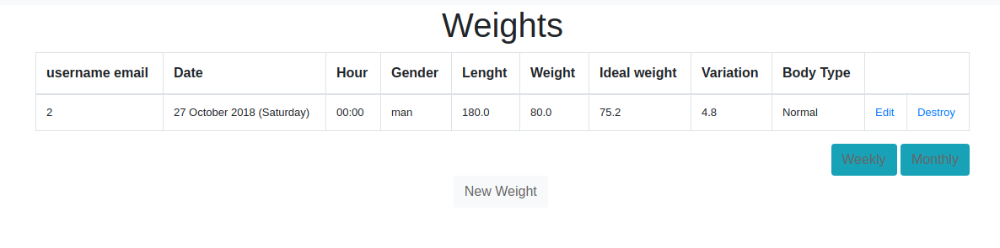
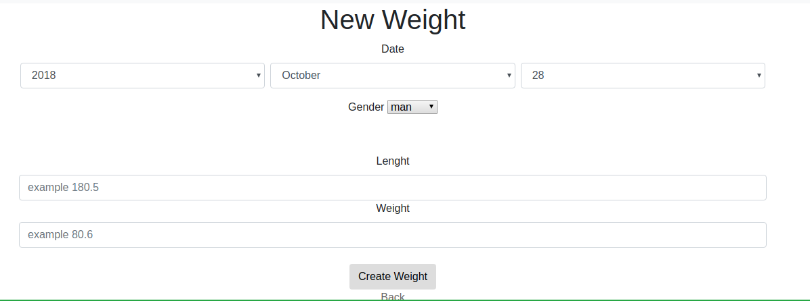

# README

## Kilo takip sistemi

- Kullanıcıların kilo ve boylarını girerek ideal kilolarını hesaplayan web uygulamasıdır.

**Kullanılan Teknolojiler**

- Ruby on Rails
- Bootstrap
- Heroku
- Postgresql

**Eklenecekler**

- [ ] Haftalık ve Aylık kilo farkı
- [ ] Haftalık ve Aylık listeyi pdf formatına çevirme
- [ ] Kullanıcı mailllerini kontrol etme ve onaylama 

# Uygulama içi ekran görüntüleri

  

  

  

  

  

  

